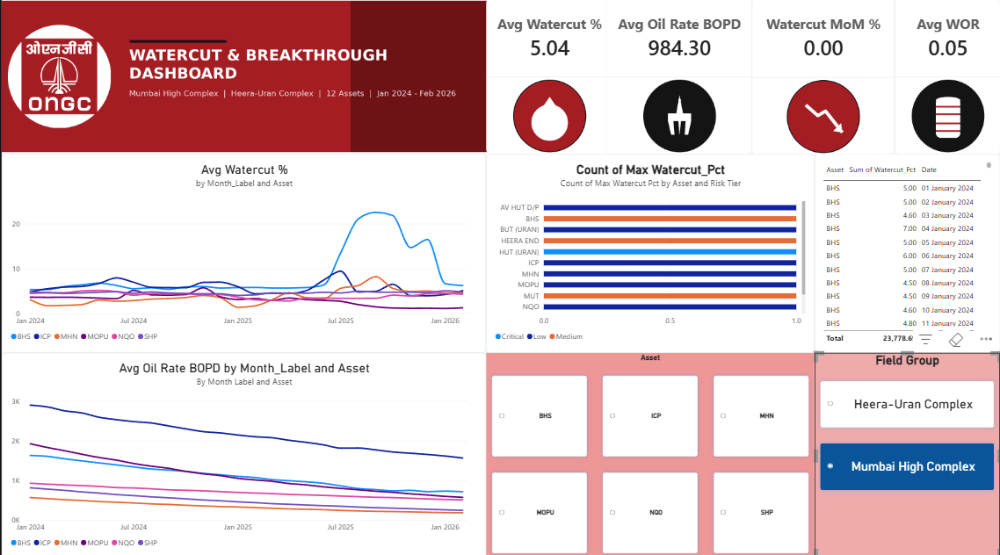
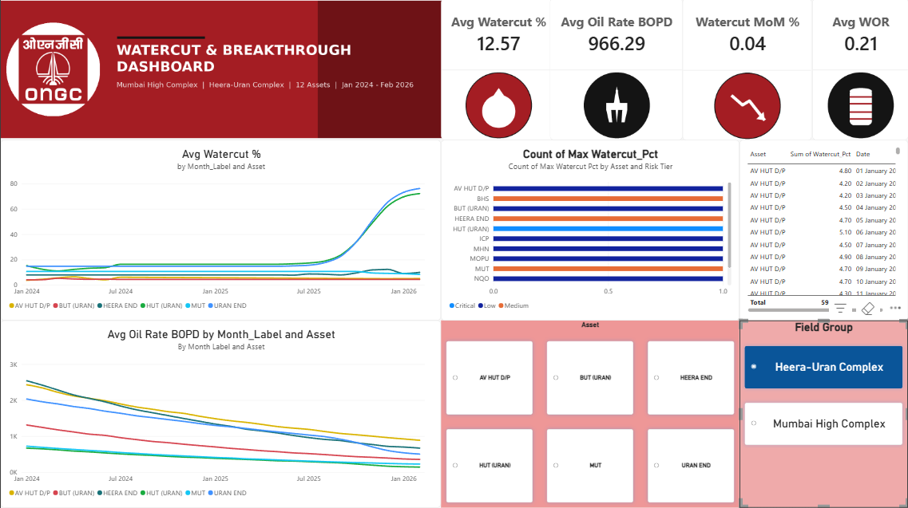

# ongc-watercut-analysis[Intern_Proj]

End-to-end analysis of daily watercut (%) readings across 12 offshore production assets in ONGC's
Mumbai High Complex and Heera-Uran Complex — 786 daily readings per asset, 9,432 rows total,
spanning Jan 2024–Feb 2026.

## What this project covers

- **SQL**: schema design, data load, and window-function queries (`LAG`, `RANK`) for month-over-month
  watercut trend analysis, water-oil ratio (WOR), and oil-rate decline tracking.
- **Excel**: a star-schema workbook (Fact/Dim tables) with formula-driven WOR and risk-tier
  calculations, ready to feed directly into Power BI.
- **Power BI**: an interactive single-page dashboard with KPI cards, trend charts, cross-filtering,
  and a custom ONGC-branded theme.

## Files in this repo

| File | Description |
|---|---|
| `ONGC_Watercut_SQL_Scripts.sql` | Schema, data load, and analysis queries (MoM trend, WOR, oil-rate decline, risk flagging) |
| `watercut_oilrate_enriched.csv` | Source data — 9,432 rows, 12 assets, watercut + derived oil-rate |
| `ONGC_Watercut_PowerBI_Model.xlsx` | Star-schema workbook (Fact/Dim tables) feeding the Power BI dashboard |
| `MUM_HIGH.png`, `BHS_ICP.png`, `URAN_HEERA.png` | Reference images |

## What's real vs. what's modeled

The original data provided during the internship contained **daily watercut % readings only**.
To demonstrate the full analysis pipeline, two things were added on top of the real data, and both
are clearly flagged in their own columns so nothing is presented as raw plant data:

| Field | Status |
|---|---|
| `Watercut_Pct`, `Asset`, `Field_Group`, `Date` (unadjusted rows) | Real — as provided |
| `WOR` (water-oil ratio) | Real — mathematically derived from watercut (`WOR = WC/(100-WC)`) |
| `Oil_Rate_BOPD` | Synthetic — modeled decline curve, since the raw extract had no oil-rate column |
| Watercut values on 2 assets, last ~9 months (`Watercut_Adjusted = 'Yes'`) | Synthetic — a modeled late-life breakthrough scenario, added so risk-flagging logic had real cases to catch |

## Tech stack

`PostgreSQL` / `SQL Server` · `Excel` (formulas, star schema) · `Power BI Desktop` (DAX, data
modeling, interactive visuals)

## Dashboard preview

[View the live interactive dashboard](https://app.powerbi.com/groups/me/reports/c50d6f69-a15b-4e39-839b-76f8c1bdba55/c8c8413103c9e8c5d6c1?experience=power-bi&clientSideAuth=0)

